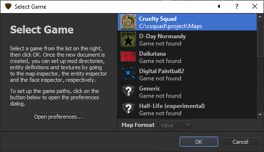

# CruS TrenchBroom Game Definiton Generator

Mod for Cruelty Squad mappers that rebuilds a TrenchBroom game definition folder on start up with improved GameConfig.cfg and mods-extended FGD.

## Requirements

Requires [`crus-modloader`](https://github.com/crustyrashky/crus-modloader) v0.2.2 or newer installed. At time of writing, only [prerelease versions](https://github.com/disco0/crus-modloader/releases) of v0.2.2 are available and should be used until official release.

## Config

If not found, a config file at the path `user://tb-conf.cfg` is created with the defaults (which are also used individually if they're not set):

- `[output]`

    - **`game_name`**: Name of game definition subfolder in `games_folder`, and title of game in TrenchBroom.

        - Default: `Cruelty Squad`

    - **`custom_icon_path`**: Path to a custom icon to display in TrenchBroom UI. For now, images must be 32x32px to avoid issues with resizing.

        - Default `res://MOD_CONTENT/trenchbroom-config/assets/custom_icon.png`
        

    - **`games_folder`**: Folder treated as a TrenchBroom game definitions folder, generated game definition will be created in a subfolder inside. For live updating of game defintions, set this to your actual TrenchBroom game definitions folder, or replace that current game definitions folder with a symlink to this.
    
        - Default: `user://game-defs`